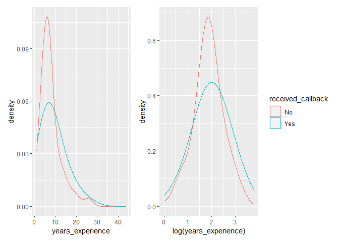

Day 1 - Simple Linear Discriminant Analysis
================

In this repository/directory you should see two items:

- `README.md` - this document.
- `activity07.Rmd` - the file you will complete in RStudio for this
  week.

## Task 1: Open the RMarkdown document

Read these directions first, then work through them.

- In the **Files** pane of RStudio, locate and click on the
  `activity07.Rmd` file to open it.
- This file is essentially a blank document with only a `title` and
  `output` option (to produce a GitHub friendly Markdown file). You will
  follow the tasks in this `README` file and do the work (coding,
  responding, etc.) in RStudio.

As you work through this activity, be descriptive in your response to
questions and even leave comments in your code to help you understand
what you are doing. These are your notes to yourself. How can you make
it easier for *future* your to remember what *current* you is
thinking/doing?

## Task 2: Load the necessary packages

Again, we will use two packages from Posit (formerly
[RStudio](https://posit.co/)): `{tidyverse}` and `{tidymodels}`.

- Once you have verified that both `{tidyverse}` and `{tidymodels}` are
  already installed (remember how to do this in the **Packages** pane?),
  load these packages in the R chunk titled `setup`. Press Enter/Return
  after line 7 to add more code lines, then type the following:

  ``` r
  library(tidyverse)
  library(tidymodels)
  ```

- Run the `setup` code chunk or **knit**
   icon
  your Rmd document to verify that no errors occur.

Remember to organize your RMarkdown document using your amazing Markdown
skills 😄

## Task 3: Load the data and

We will continue using the resume data from the OpenIntro site that we
first explored in Activity 6 (Days 1 & 2). Read in the following **CSV**
file using the URL method:
`https://www.openintro.org/data/csv/resume.csv`

- Create a new R code chunk to read in the linked CSV file.
- Rather than downloading this file, uploading to RStudio, then reading
  it in, explore how to load this file directly from the provided URL
  with the appropriate `{readr}` function (remember that `{readr}` is
  part of `{tidyverse}` so you do not need to load/`library` it
  separately).
- Assign this data set into a data frame named `resume`.

### The data

Recall from OpenIntro’s [description of the
data](https://www.openintro.org/data/index.php?data=resume):

> This experiment data comes from a study that sought to understand the
> influence of race and gender on job application callback rates. The
> study monitored job postings in Boston and Chicago for several months
> during 2001 and 2002 and used this to build up a set of test cases.
> Over this time period, the researchers randomly generating résumés to
> go out to a job posting, such as years of experience and education
> details, to create a realistic-looking résumé. They then randomly
> assigned a name to the résumé that would communicate the applicant’s
> gender and race. The first names chosen for the study were selected so
> that the names would predominantly be recognized as belonging to black
> or white individuals. For example, Lakisha was a name that their
> survey indicated would be interpreted as a black woman, while Greg was
> a name that would generally be interpreted to be associated with a
> white male.

Linear discriminate analysis (LDA) is another method for classification
problems. For LDA, we make assumptions about the distribution of the
explanatory/independent variable(s) given the response/dependent
variable (e.g., $X | Y \sim \text{Normal}$). This method then uses
Bayes’ theorem to build a classifier for the likelihood of belonging to
one of the levels of the response variable.

For this activity, we will perform an LDA for the explanatory variable
`years_experience` and response variable `received_callback`.

Answer the following question:

1.  Below, I provide you with two plots that display the distribution of
    `years_experience` and `log(years_experience)` *given*
    `received_callback`. These are *density* plots - I think of these as
    smoothed histograms. Which of these two versions of
    `years_experience` satisfy the assumption of
    $X | Y \sim \text{Normal}$? Explain your reasoning.

<!-- -->

## Task 4: LDA

Fitting the model is fairly straightforward.

- Verified that `{discrim}` is not installed (remember how to do this in
  the **Packages** pane?), then install this package in your **Console**
  pane.

- Create a new R code chunk and type the following, then run your code
  chunk or knit your document.

  ``` r
  # Convert received_callback to a factor with more informative labels
  resume <- resume %>% 
    mutate(received_callback = factor(received_callback, labels = c("No", "Yes"))

  # LDA
  library(discrim)
  lda_years <- discrim_linear() %>% 
    set_mode("classification") %>% 
    set_engine("MASS") %>% 
    fit(received_callback ~ log(years_experience), data = resume)

  lda_years
  ```

Now, answer the following questions:

Looking at the `Group means:` portion of the above output, you have the
mean of `log(years_experience)` for whether a résumé received a call
back.

2.  What do you notice about these two values?
3.  How does this correspond to the appropriate density plot above? That
    is, what feature of these curves are you comparing?

## Task 5: Predictions

Predictions for LDA are done similarly to how we did them for logistic
and multinomial regression.

- Create a new R code chunk and type the following, then run your code
  chunk or knit your document.

  ``` r
  predict(lda_years, new_data = resume, type = "prob")
  ```

This output gives us the likelihood for a particular résumé to be in the
“No” or “Yes” callback group. However, looking at this is rather
overwhelming (over 4,000 observations!) so we will now create a
confusion matrix to look at the performance of our model.

- Create a new R code chunk and type the following, then run your code
  chunk or knit your document.

  ``` r
  augment(lda_years, new_data = resume) %>% 
    conf_mat(truth = received_callback, estimate = .pred_class)
  ```

4.  What do you notice? Why do you think this happened?

We can also look at the overall accuracy of our model (i.e., how often
did it correctly predict the actual outcome).

- Create a new R code chunk and type the following, then run your code
  chunk or knit your document.

  ``` r
  augment(lda_years, new_data = resume) %>% 
    accuracy(truth = received_callback, estimate = .pred_class)
  ```

So the model was right about 92% of the time… because it never predicted
that someone would receive a callback. Note that this 92% corresponds to
the “No” rate in the response variable

| received_callback |    n | prop |
|:------------------|-----:|-----:|
| No                | 4478 | 0.92 |
| Yes               |  392 | 0.08 |

## Challenge 1: Compare with logistic regression

Fit a similar model as we just explored, but instead using logistic
regression. Discuss how the results are similar and different.

## Challenge 2: LDA with multiple explanatory variables

Fit an LDA model similar to the one you explored in Day 2 of Activity 6.
In that activity, you fit:

$$
\begin{equation*}
\log\left(\frac{\hat{p}}{1-\hat{p}}\right) = \hat\beta_0 + \hat\beta_1 \times (\texttt{years\\_experience}) + \hat\beta_2 \times (\texttt{race:White}) + \hat\beta_3 \times (\texttt{sex:male})
\end{equation*}
$$

Discuss how the results are similar and different.

## What is next?

We will have our second mini-competition next week. The second day of
this week is devoted to your project work.
